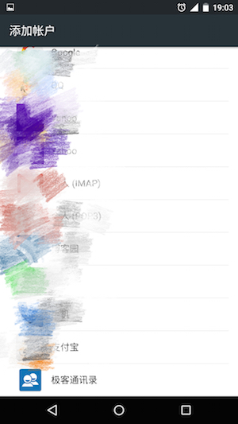
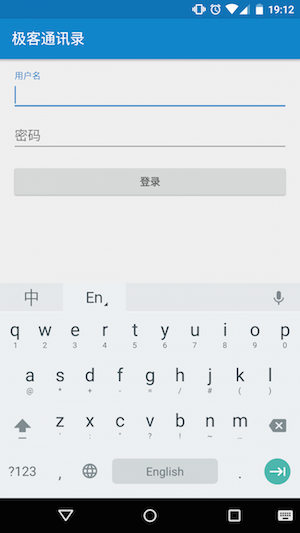
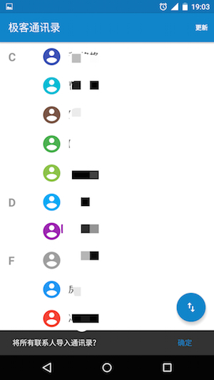
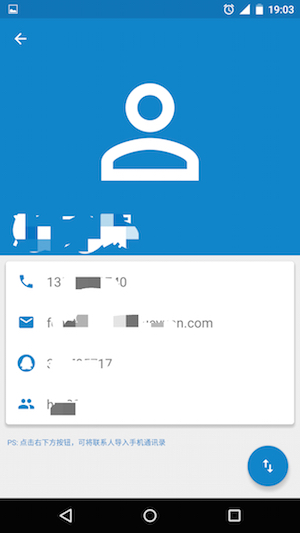

#极客通讯录

极客通讯录仅供极客学院内部员工使用，方便内部人员沟通。

##Feature

1. 账号登录，查看内部通讯录信息；
2. 一键导入联系人至手机通讯录，支持批量操作和单点操作；

##Download
via Google Play Store

扫码下载

下载APK

[app-release-1.0.0.apk](doc/app-release-1.0.0.apk)

##Development
项目采用了后起之秀Kotlin为主开发语言，开发环境级版本如下：

1. AndroidStudio 1.4 + kotlin 1.0.o-beta-1038
2. OSX Yosemite 10.10.4

##Reference

1. [极客学院 http://work.eoemobile.com](http://work.eoemobile.com/)
2. [Kotlin https://kotlinlang.org/](https://kotlinlang.org/)
